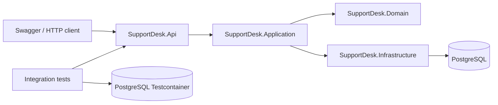
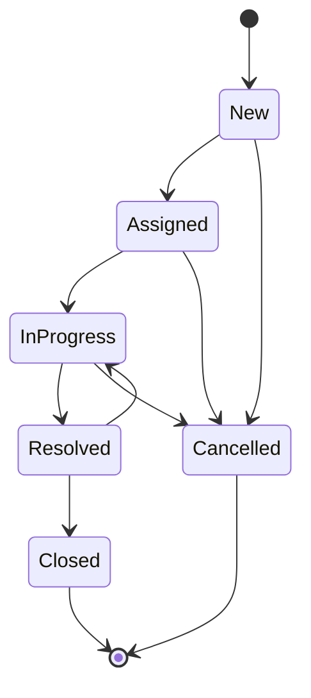

# SupportDesk API

SupportDesk API is an MVP backend service for internal support ticket management.

The project demonstrates a real backend flow without a frontend: a user creates a ticket, a support agent processes it, comments are added, status changes are stored, access rules are enforced, and the behavior is verified through automated tests.


## MVP scope

This README describes the current MVP version of the project.

Implemented in the MVP:

- ASP.NET Core Web API
- Controller-based REST API
- PostgreSQL persistence
- Entity Framework Core migrations
- Ticket lifecycle
- Ticket comments
- Ticket history
- JWT authentication
- Role-based authorization
- Seed demo users
- Filtering, sorting, and pagination for ticket queries
- Unit tests
- Integration tests with Testcontainers
- Docker Compose for local infrastructure
- Swagger/OpenAPI documentation

Not included in the MVP yet:

- Frontend application
- User registration
- RabbitMQ
- Redis
- gRPC
- Prometheus metrics
- File attachments
- Real email notifications

These features are intentionally outside the MVP and can be added later as production-oriented extensions.

## Tech stack

- C#
- .NET
- ASP.NET Core Web API
- Entity Framework Core
- PostgreSQL
- JWT Bearer authentication
- xUnit
- FluentAssertions
- WebApplicationFactory
- Testcontainers for .NET
- Docker Compose
- Swagger/OpenAPI

## Architecture

The solution is split into separate projects to keep HTTP, application logic, domain rules, and infrastructure concerns isolated.

```text
SupportDesk.Api
  HTTP API, controllers, authentication, authorization, Swagger, dependency injection

SupportDesk.Application
  Application services and use cases

SupportDesk.Domain
  Domain entities, enums, lifecycle rules, domain exceptions

SupportDesk.Infrastructure
  EF Core DbContext, entity configurations, migrations, persistence, auth infrastructure

SupportDesk.Contracts
  Request and response contracts shared by API and tests

SupportDesk.UnitTests
  Unit tests for domain rules

SupportDesk.IntegrationTests
  End-to-end HTTP tests with Testcontainers and a real PostgreSQL instance
```



## Ticket lifecycle



Business rules are enforced by the domain model and application layer. A ticket status cannot be changed by assigning the `Status` property directly from the outside.

## Roles

| Role | Permissions |
| --- | --- |
| User | Creates tickets, views own tickets, comments on own tickets, closes resolved tickets |
| SupportAgent | Views available or assigned tickets, assigns tickets to self, starts progress, comments, resolves tickets |
| Admin | Views all tickets and has administrative access to ticket data |

## Demo users

The application uses seeded users for the MVP. Registration is not implemented intentionally.

| Role | Email | Password |
| --- | --- | --- |
| User | `user@example.com` | `Password123!` |
| SupportAgent | `agent@example.com` | `Password123!` |
| Admin | `admin@example.com` | `Password123!` |

## API overview

### Auth

| Method | Endpoint | Description |
| --- | --- | --- |
| POST | `/api/auth/login` | Returns JWT access token |

### Tickets

| Method | Endpoint | Description |
| --- | --- | --- |
| POST | `/api/tickets` | Create a ticket |
| GET | `/api/tickets` | Search tickets with filters, sorting, and pagination |
| GET | `/api/tickets/{id}` | Get ticket by id |
| POST | `/api/tickets/{id}/assign` | Assign ticket |
| POST | `/api/tickets/{id}/start` | Move ticket to InProgress |
| POST | `/api/tickets/{id}/resolve` | Resolve ticket |
| POST | `/api/tickets/{id}/close` | Close resolved ticket |
| POST | `/api/tickets/{id}/cancel` | Cancel ticket |

### Comments

| Method | Endpoint | Description |
| --- | --- | --- |
| POST | `/api/tickets/{id}/comments` | Add comment to ticket |
| GET | `/api/tickets/{id}/comments` | Get ticket comments |

### History

| Method | Endpoint | Description |
| --- | --- | --- |
| GET | `/api/tickets/{id}/history` | Get ticket status history |

## Query example

```http
GET /api/tickets?status=New&status=InProgress&priority=High&page=1&pageSize=20&sortBy=CreatedAt&sortDirection=Descending
Authorization: Bearer <access_token>
```

The list endpoint applies filtering, sorting, and pagination at the database query level. It does not load all tickets into memory before filtering.

## Requirements

- .NET SDK compatible with the project
- Docker Desktop or Docker Engine
- Git
- Optional: PostgreSQL client, DBeaver, Rider, Visual Studio, or VS Code

Docker must be running for both local PostgreSQL and integration tests with Testcontainers.

## Run locally


Start PostgreSQL through Docker Compose:

```bash
docker compose up -d
```

Apply EF Core migrations:

```powershell
dotnet ef database update --project .\SupportDesk.Infrastructure\SupportDesk.Infrastructure.csproj --startup-project .\SupportDesk.Api\SupportDesk.Api.csproj
```

Run the API:

```powershell
dotnet run --project .\SupportDesk.Api\SupportDesk.Api.csproj
```

Open Swagger:

```text
http://localhost:5042/swagger
```

If the application starts on a different port, use the URL printed by `dotnet run`.

## Run tests

```powershell
dotnet test
```

The integration tests use Testcontainers to start a real PostgreSQL container during the test run. This means the tests do not depend on a manually prepared local database.


The test suite covers:

- Domain lifecycle rules
- Authentication
- Authorization
- Ticket creation
- Ticket visibility by role
- Full ticket lifecycle through HTTP
- Persistence through EF Core and PostgreSQL

## Example login request

```http
POST /api/auth/login
Content-Type: application/json

{
  "email": "user@example.com",
  "password": "Password123!"
}
```

Example response:

```json
{
  "accessToken": "<jwt_access_token>",
  "expiresAt": "2026-05-14T12:00:00Z"
}
```

## Example ticket creation request

```http
POST /api/tickets
Authorization: Bearer <access_token>
Content-Type: application/json

{
  "title": "Cannot access internal portal",
  "description": "The user cannot sign in to the internal company portal.",
  "priority": "High"
}
```

## Suggested demo flow

The MVP can be demonstrated without a frontend.

Recommended flow:

1. Start PostgreSQL with Docker Compose.
2. Apply EF Core migrations.
3. Run the API.
4. Open Swagger.
5. Login as `user@example.com`.
6. Create a ticket.
7. Login as `agent@example.com`.
8. Assign the ticket.
9. Move the ticket to `InProgress`.
10. Add a comment.
11. Resolve the ticket.
12. Login as `user@example.com` again.
13. Close the resolved ticket.
14. Open ticket history.
15. Run `dotnet test` and show that integration tests pass with Testcontainers.

## Recommended demo media

GIFs are optional, but they can make the repository more convincing if they are short and technical.

Recommended recordings:

- `docs/assets/swagger-ticket-lifecycle.gif`: login, create ticket, assign, start, resolve, close, history.
- `docs/assets/testcontainers-tests.gif`: `dotnet test` showing integration tests and Testcontainers startup.
- `docs/assets/query-filtering.gif`: Swagger request with filtering, sorting, and pagination.

Do not add large videos directly to the repository. If a video is needed, keep it outside the repository and link to it from the README.

## Current limitations

- Authentication uses seeded demo users.
- There is no registration flow.
- There is no frontend.
- There are no real notifications.
- There is no distributed messaging in the MVP.
- There is no Redis cache in the MVP.
- There is no gRPC service in the MVP.
- There are no production metrics in the MVP.

These limitations are deliberate. The MVP focuses on a complete backend flow, database persistence, authorization, and automated testing.

## Roadmap

Planned production-oriented extensions:

- Transactional outbox
- Background worker for outbox processing
- RabbitMQ publisher and consumer
- Structured logging
- Correlation id middleware
- Readiness and liveness health checks
- gRPC UserDirectory service
- Redis cache for ticket statistics
- Prometheus-compatible metrics
- k6 load test scenario

## What this project demonstrates

This project is designed to show backend engineering fundamentals:

- Separating HTTP, application, domain, and infrastructure layers
- Modeling business rules in the domain instead of controllers
- Persisting data through EF Core and PostgreSQL
- Using migrations to evolve the database schema
- Protecting endpoints with JWT authentication and role-based authorization
- Testing real HTTP behavior with WebApplicationFactory
- Running integration tests against real PostgreSQL through Testcontainers
- Keeping the MVP focused instead of adding distributed-system components too early
